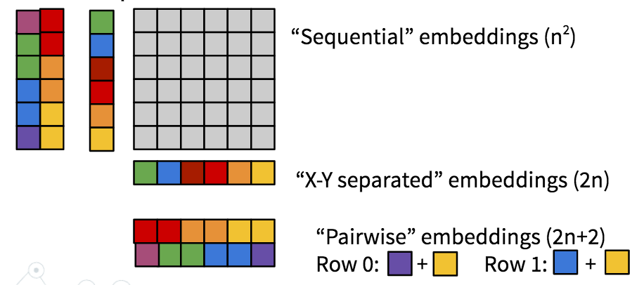

- fmnist_classifier.py
- fmnist_autoencoder.py

Data from [Fashion MNIST](https://www.kaggle.com/zalando-research/fashionmnist)

Simple experiments with the [transformer](https://github.com/jadore801120/attention-is-all-you-need-pytorch) model using an alternative positional embedding scheme.
The X-Y Separated embedding has 2n embeddings representing n*n pixels. 

